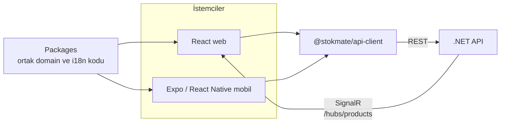

# StokMate

[](https://github.com/celal2344/stokmate/actions/workflows/ci.yml)
[](https://github.com/celal2344/stokmate/actions/workflows/android-preview.yml)

|                                                       Web — ürün yönetimi                                                        |                                                    Mobil — saha stok güncelleme                                                    |
| :------------------------------------------------------------------------------------------------------------------------------: | :--------------------------------------------------------------------------------------------------------------------------------: |
|  |  |

## Kullandığım AI Workflow

1. **[grill-me](https://www.aihero.dev/skills-grill-me) skilli ile kapsamlı şekilde genel proje planlamasını yaptım. 4 adet agent kullandım: Danışman, Lead, web ve mobil developer**
2. **Danışman agent ile bu planı takip ederek gate'ler oluşturdum**
3. **Bu gateleri lead agent ile uyguladım.**
4. **Lead agent genel kontroller yapıp temeli hazırlayıp gate deki görevleri web ve mobil agent'lara atadı**
5. **Lead bu agentlardan gelen sonuçları test ve review etti**
6. **Bu sonuçları daha sonra ben review ve test ettim**
7. **Düzenleme veya geliştirme gerekliyse danışman agent ile planlayıp best practice haline getirip lead ile uygulattım**
8. **Tekrar değişiklikleri test ve review ettim**
9. **commit/push**

## Mimari



Hazır .NET API'si kullanılarak Swagger docs üretilir bu docs Orval ile typeları ve endpointleri bulunduran api-client paketine çevirilir. Web ve mobil bunu ortak kullanır.
SignalR ayrı bi hub endpointi üzerinden doğruca .NET API'ye bağlanır.

### Kurulum

```bash
pnpm install
pnpm run dev
```

Turborepo sayesinde API, web ve mobil aynı anda başlar.

- Web: `http://localhost:5173`
- API: `http://localhost:5080`
- Swagger: `http://localhost:5080/swagger`
- Expo geliştirme sunucusu: terminalde gösterilen yerel adres

Test hesabı:

```text
E-posta: test@ornek.com
Şifre:   Test1234!
```

<p align="center">
    
  </p>

> Telefonda API adresi olarak bilgisayarınızın yerel ağ IPv4 adresini girin. `ipconfig` terminal komutu ile
> öğrenebilirsiniz.

## Özellikler

### Web

- Login, session restoration, logout ve protected routes
- Server-side search, filter, sorting ve pagination
- URL-synced list state ve browser back/forward desteği
- Loading, error, empty state, validation ve mutation hataları
- Turkish/English language switch ile light/dark/system theme desteği

### Mobil

- Search, filters, active filter chips ve load more sayfa akışı
- Pull-to-refresh, focus refetch ve kararlı FlashList satırları
- Telefon kamerası ile barcode tarama
- Turkish/English language switch ile light/dark/system theme desteği
- SecureStore token storage

### Sağlanan API'ye eklenenler

- `GET /products/{id}` — tam ürün detayını döndürür.
- `PATCH /products/{id}` — `name`, `price`, `stock` ve `status` alanlarını günceller.
- `/hubs/products` — ürün listesi anlık güncellemelerini sağlar.

### Monorepo yapısı

```text
stokmate/
├── api/                  # .NET
├── apps/
│   ├── web/              # React + Vite
│   └── mobile/           # Expo / React Native
├── packages/
│   ├── api-client/       # Orval api-client
│   ├── domain/           # query keyler ve utils
│   └── i18n/             # çeviri kaynağı
```

## Teknoloji tercihleri

- **pnpm + Turborepo**
- **Swagger/OpenAPI + Orval**
- **Zod 4**
- **React 19 + Vite**
- **TanStack Query**
- **TanStack Router**
- **TanStack Form**
- **TanStack Table**
- **shadcn/ui + Tailwind CSS 4**
- **Expo + React Native**
- **Expo Router + Expo SecureStore**
- **FlashList + Expo Image**
- **Expo Camera**
- **i18next**
- **SignalR**
- **GitHub Actions + EAS Build**
